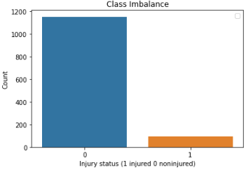
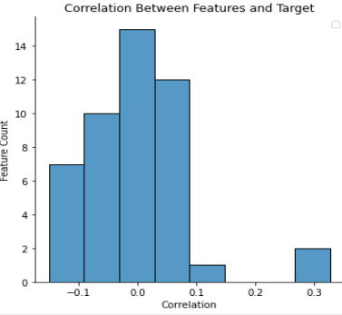
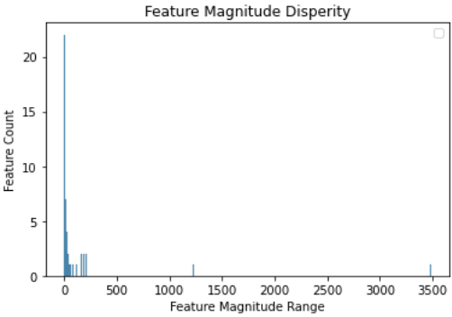
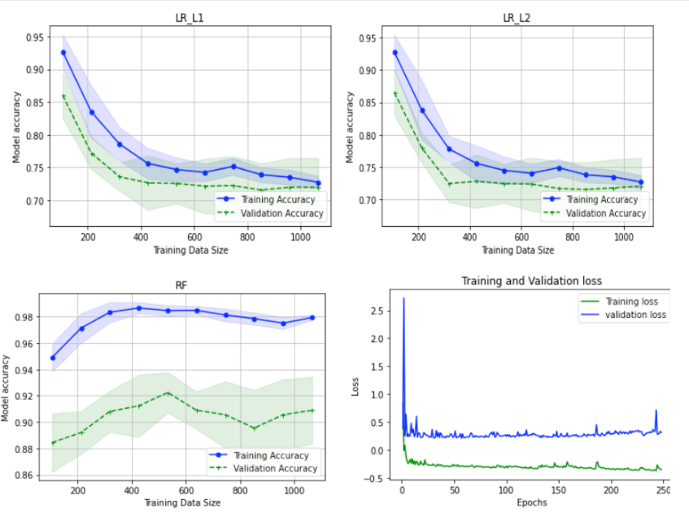
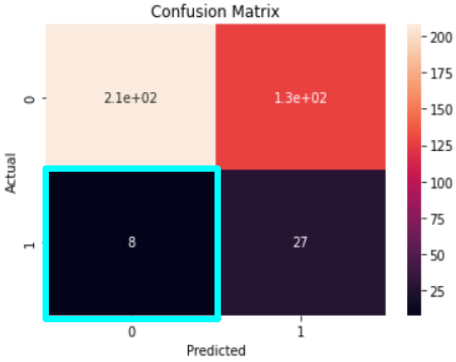

# The Silent Killer: Underlying Factors in Soccer Injuries

Behind the spectacle of goals and triumphant victories in European football, lie the silent tales of injuries, an understated yet influential player in the game. By applying machine learning to injury data, our investigation uncovers a hidden dimension to club success, revealing an often overlooked but crucially important aspect of the beautiful game.

Motivation for this project is highly inspired by the movie [Money Ball](<https://en.wikipedia.org/wiki/Moneyball_(film)>) and my own love for Football.

Visca Barca! 🔴🔵

## Table of Contents

- [Table of Contents](#table-of-contents)
- [Introduction](#introduction)
  - [Methodologies Used](#methodologies-used)
  - [Tech Stack](#tech-stack)
- [Data Collection](#data-collection)
- [Data and Model Engineering](#data-and-model-engineering)
  - [Need for Engineering](#need-for-engineering)
  - [Model Engineering Techniques](#model-engineering-techniques)
- [Model Building](#model-building)
- [Results](#results)
  - [Best Model 🏆](#best-model-🏆)
- [Discussion and Future Steps](#discussion-and-future-steps)

## Introduction

Brazil, favourites to win the 2014 FIFA World Cup, saw their prospects diminish following the injuries of star player Neymar. With their subsequent 7-1 loss to Germany, Brazil became a key example of how injuries can alter the outcome of a match and dictate team success. This investigations primary aim is to create predictive supervised learning models to assess the risk of injuries in soccer players, using binary classification. These predictive models could provide valuable insights for coaching and management staff, enabling them to mitigate injury risks by adjusting player workload, increasing physiotherapy, or making informed decisions during player signings. The overall goal is to decrease the number of injuries within a team, allowing players to maintain optimal performance throughout the season. As a secondary objective, the project will also strive to uncover and understand the underlying factors that either contribute to, or protect against, these injuries.

### Methodologies Used

- Web Scraping
- Supervised Machine Learning
- Data Engineering
- Inferential Statistics
- Data Visualization

### Tech Stack

The following libraries are used in this project:

- **Pandas and Numpy**: These libraries are fundamental for data manipulation and analysis.

- **Matplotlib**: Used for data visualization to create insightful charts and plots.

- **TensorFlow and Keras**: These two powerful libraries are used for creating and training the Neural Network used in the project.

- **Scikit-Learn**: A comprehensive machine learning library used in this project for tasks such as training classifiers, model selection, and preprocessing.

- **Ast**: Used for working with Python's abstract syntax trees, which are crucial for certain data manipulation tasks.

- **OS and Warnings**: Used for interacting with the operating system and handling warnings, ensuring smooth execution of the code.

- **Datetime**: An essential library for manipulating dates and times, crucial for certain data preprocessing tasks.

- **Re**: Used for working with regular expressions, allowing for advanced string manipulation.

- **Requests and BeautifulSoup4**: These libraries are used for web scraping tasks, to collect the necessary data for analysis.

## Data Collection

In order to build effective models, a comprehensive dataset scraped from Transfermarkt and FBREF was necessary. This dataset included a diverse range of biometric and in-game statistical data for soccer players competing in Europe's top 5 leagues. The target feature was the player's current injury status.

Our preparation process was thorough, with meticulous data cleaning and pre-processing undertaken to ensure the dataset was fit for purpose. This included unpacking arrays, manipulating strings, encoding categorical data, and addressing missing values.

After eliminating duplicate entries and resolving inconsistencies in player names across the two sources, we compiled a robust, cleaned dataset of 1923 entries. Each entry was one-hot-encoded into numeric types to ensure the data was ready for use in our predictive models.

## Data and Model Engineering

To provide insight into our data and influence modeling decisions, we conducted exploratory data analysis (EDA) on both training and testing data. The results of our EDA would help us answer questions relating to model parameters, model performance, model engineering techniques, and further tuning of the dataset.

  

The training data initially showed a class imbalance, with more non-injured than injured player entries. This could impact the model's precision, making it biased towards non-injury predictions. To address this, we used the SMOTE oversampling technique to balance the dataset. Similarly, the testing set also had class imbalance. To fix this, we adjusted the distribution of injured player entries between the training and testing sets before model training to ensure unseen data during testing.

### Need for Engineering

  

The EDA indicated that the initial features in the dataset had low correlation with the target, which provided limited insights into the impact of the features on our target. This necessitated the implementation of feature engineering to discover features that might have a stronger correlation with the target.

  

The EDA also revealed large differences in magnitudes among the features. This disparity can affect the performance of models that use gradient descent-based algorithms, like the Artificial Neural Network (ANN) model used in this project. Unscaled features can lead to slower training and suboptimal solutions. To mitigate this, we decided to implement feature scaling to standardize the range of the feature values, which can result in faster and more effective training of the ANN model.

### Model Engineering Techniques

The initial EDA suggested that the raw train-test-validation dataset split needed improvement. Given the relatively small initial dataset, it was important to implement model engineering techniques to avoid overfitting and enhance model performance. First, outliers in the training set were identified and removed using an isolation forest.

In addition SMOTE and three techniques: feature scaling, feature engineering, and feature selection.

Feature scaling was performed using normalization, as most of the data didn't follow a Gaussian distribution. This adjustment improved loss scores, accuracy, and training time in the neural network.

Feature engineering was done using a combinatorial approach, considering products of all features, and informed by domain knowledge. This process led to new features with increased correlation to the target.

Lastly, feature selection was implemented to reduce redundancy and focus on the most informative features, resulting in a final selection of 15 features.

## Model Building

### Baseline Selection

Initial baseline models included logistic regression (LR), a random forest classification model (RF), and an artificial neural network (ANN). We used lasso (L1) and ridge (L2) regularization with LR to improve model accuracy without additional engineering. RF, being robust to missing values and outliers, was chosen for its ensemble learning capability and stability in reducing overfitting.

LR and RF models were chosen for their simplicity, fast implementation, and fewer parameters, allowing for better generalization and more accurate results on the test set. Considering the small dataset size, it was crucial to avoid overly complex models that risk overfitting. However, to contrast with simpler models, we also included an ANN, a complex model with many parameters.

Baseline models were assessed mainly with default hyperparameters, providing a reference point for later optimizations.

### After Hyperparameter Tuning

With the dataset now optimized, hyperparameters for Logistic Regression (LR) and Random Forest (RF) were tuned using grid search and random search, respectively, considering computation time limitations. This step, incorporating cross-validation, reduced overfitting and improved prediction accuracy.

- LR-L1: random_state = 0, C = 10.0, class_weight = 'balanced', solver = "saga"
- LR-L2: random_state = 0, C = 1.0, class_weight = 'balanced', solver = "newton-cg"
- RF: n_estimators = 40, min_samples_split = 6, min_samples_leaf = 5, max_features = 'sqrt', max_depth = 10, criterion = 'entropy', class_weight='balanced'
- ANN: epochs = 250, batch_size = 32, optimizer = ‘adam’, loss = 'binary_crossentropy', activation = relu, 3 hidden layers

## Results

Before implementing models, we set a threshold of 0.4 for classifying the target value to account for class imbalance. This adjustment allows for more true positives at the expense of higher false negatives, which is acceptable given our problem context. Mislabeling a player as at risk only results in increased caution, potentially aiding their physical fitness.

Quantitatively, initial performance of our models was not satisfactory; the RF model showed zero precision, recall, and score, and an ROC AUC score of 0.5, which equates to random guessing. Similarly, the ANN model demonstrated a low precision of 0.143, recall of 0.029, score of 0.086, and ROC AUC of 0.5.

After refining our models, significant improvements were observed. The RF model showed a precision of 0.184, recall of 0.400, score of 0.292, and ROC AUC of 0.608. Most notably, the LR-L2 model showed a precision of 0.181, recall of 0.851, score of 0.519, and an impressive ROC AUC of 0.726.

  

The learning curves demonstrated good fits for the LR-L1, LR-L2, and ANN models, with accuracy converging over time. In contrast, the RF model showed signs of overfitting, as indicated by its training accuracy plateauing near 1 and the validation accuracy initially increasing then decreasing.

### Best Model 🏆

  

After final analysis, the LR-L2 model displayed superior performance with an increased recall by 0.234 post-engineering, denoting its effectiveness in correctly identifying true positives. The model also exhibited a false negative rate of 23%, which, again, is an acceptable error given the context. It may lead to some players being overcautiously labeled as at risk, but this ultimately promotes overall squad health. Moreover, the LR-L2 model exhibited neither underfitting nor overfitting on the loss curve indicating a balanced bias-variance trade-off. With an ROC AUC of 0.726, LR-L2 proved to be a robust tool for providing valuable insights to soccer teams, despite the initial low correlation of selected features with the target.

## Discussion and Future Steps

This exploration into predicting soccer injuries kicked off with an interesting coincidence. While testing our models, one identified Neymar, the world-renowned Brazilian footballer, as at risk of injury. Funny enough, a week earlier, Neymar sustained an injury during a match against Serbia in the 2022 Qatar World Cup. It seemed our model was onto something. However, it's important to note that Neymar has a history of numerous injuries, a factor that is highly correlated with our model's predictions.

Nonetheless, this investigation aimed to develop models to flag players potentially at risk of injury. Early data exploration uncovered weak feature correlations and inherent dataset issues. Initial performances of models including LR, RF, and ANN, were less than stellar.

After incorporating model engineering techniques, results showed an improvement, particularly the LR-L2 model. Still, the model's low precision score was concerning. It showed a tendency to label healthy players as injury-prone. In real-world terms, this could lead to unnecessary precautions, while tolerable, could start to affect team strategies and player performance.

This study had its limitations. The dataset, sourced from Europe's top 5 leagues, was narrow and featured many low-correlation variables. Future work should extend to a more global dataset and investigate relevant features like biometrics and diet.

Despite these shortcomings, this study provided insights into factors that don't significantly contribute to injuries. The LR-L2 model, despite its limitations, demonstrated a recall of 0.851, offering a satisfactory response to the initial problem statement. So, while it's clear that improvements can be made, this investigation has laid solid groundwork for future research in sports injury prediction.

If you would like to discuss all thing data science and Football further or would like to the full report please reach out to me on LinkedIn or osman.sultan@mail.utoronto.ca.
